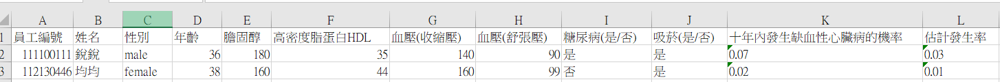

# Framingham-calculator 十年心血管風險計算(未完成)

>Tip: 因目前除了wecare可以大量計算外, 還沒看到有人寫這功能
>Tip: wecare 限制太多, 也操作複雜, 所以想寫一個方便操作的自動化解決方案

- [X] 確定可以執行並計算正確
- [ ] 自動抓取properties的功能還沒寫好 

`是希望使用者匯入excel表格後, 程式會自己抓需要的欄位計算, 但要考量每個表單表達的方式不同, 例如 HDL 或 高密度脂蛋白 等 命名不同的問題`

* 第一個自己用golang寫的小功能, 意義重大, 也是自己開始接觸編譯語言的第一步

## excel 目前需要整理固定的欄位給程式計算

範例和執行結果展示如下:

